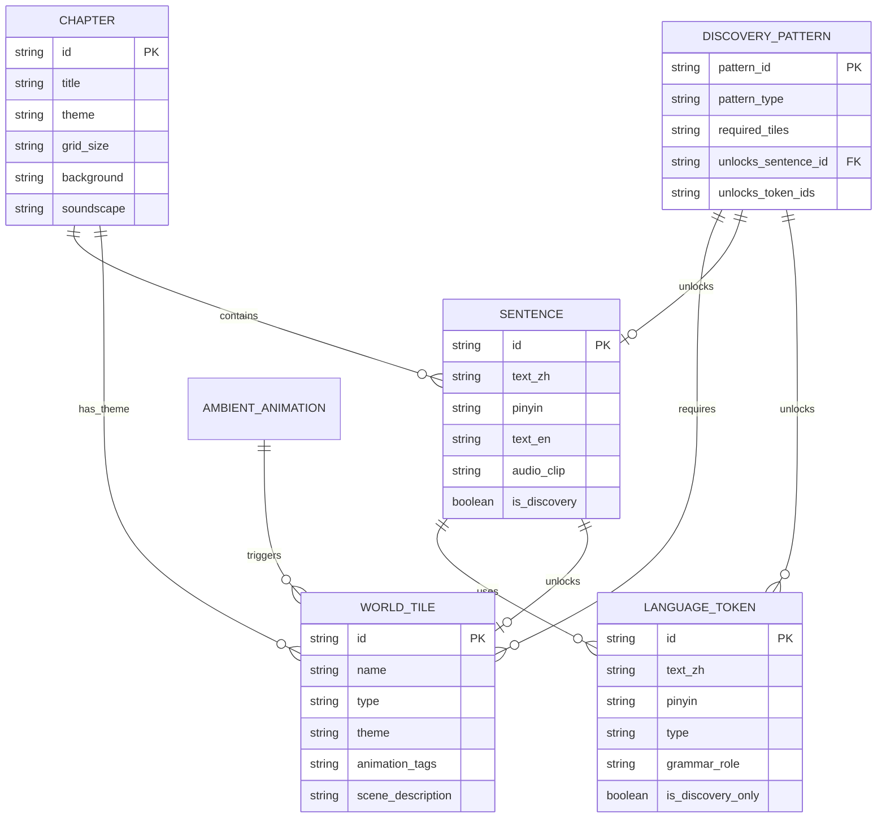
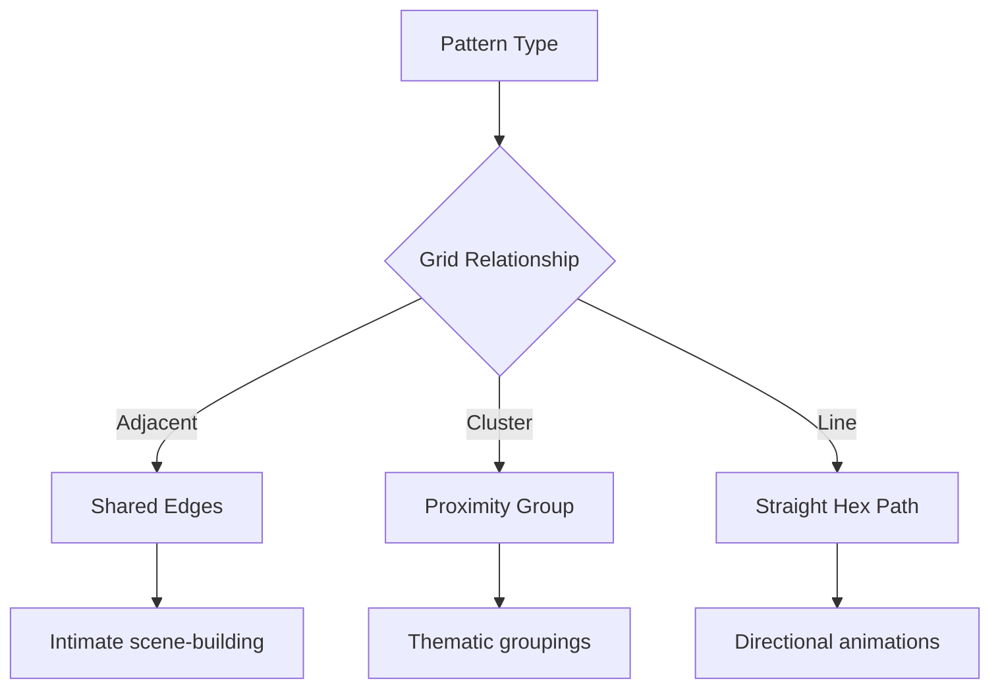

### Entity Relationship Diagram (ERD)


### Explanation of Relationships
1. **Chapters contain Sentences** (1-to-many)  
   - Each chapter has multiple sentences
   - Sentences can appear in multiple chapters (junction table needed)

2. **Sentences use Tokens** (many-to-many)  
   - Sentences are built from language tokens
   - Tokens can be reused in multiple sentences

3. **Sentences unlock World Tiles** (1-to-1)  
   - Completing a sentence unlocks a specific tile

4. **Discovery Patterns require World Tiles** (many-to-many)  
   - Patterns are combinations of tiles
   - Tiles can be part of multiple patterns

5. **Discovery Patterns unlock Sentences/Tokens** (1-to-many)  
   - Patterns unlock special discovery sentences
   - Patterns can unlock new language tokens

---

### Google Sheets Structure
**1. Chapters (`📖 Chapters`)**
| Column Name     | Data Type   | Required | Example             | Description |
|-----------------|-------------|----------|---------------------|-------------|
| id*             | Text        | Yes      | "chap1_park"       | Unique chapter ID |
| title*          | Text        | Yes      | "Morning Park"     | Display name |
| theme*          | Text        | Yes      | "nature"           | Visual theme |
| grid_size       | Text        | No       | "10x8"             | Hex grid dimensions |
| background      | Text        | No       | "bg_park_day"      | Background asset |
| soundscape      | Text        | No       | "ambient_birds"    | Audio asset |
| unlock_condition| Text        | No       | "complete_chap1"   | Progression requirement |

**2. Sentences (`💬 Sentences`)**
| Column Name        | Data Type   | Required | Example             | Description |
|--------------------|-------------|----------|---------------------|-------------|
| id*                | Text        | Yes      | "sent_greet1"      | Unique ID |
| text_zh*           | Text        | Yes      | "你好"             | Chinese text |
| pinyin*            | Text        | Yes      | "nǐ hǎo"           | Pronunciation |
| text_en*           | Text        | Yes      | "Hello"            | Translation |
| audio_clip*        | Text        | Yes      | "audio/greet1.mp3" | Voice file |
| is_discovery       | Boolean     | No       | FALSE              | Discovery sentence? |
| hint_en            | Text        | No       | "Friendly greeting"| Learner hint |

**3. Language Tokens (`📚 Tokens`)**
| Column Name       | Data Type   | Required | Example     | Description |
|-------------------|-------------|----------|-------------|-------------|
| id*               | Text        | Yes      | "verb_eat"  | Unique ID |
| text_zh*          | Text        | Yes      | "吃"        | Chinese text |
| pinyin*           | Text        | Yes      | "chī"       | Pronunciation |
| type*             | Text        | Yes      | "verb"      | noun/verb/modifier/etc |
| grammar_role*     | Text        | Yes      | "action"    | Sentence role |
| is_discovery_only | Boolean     | No       | FALSE       | Unlocked via discovery? |

**4. World Tiles (`🌍 WorldTiles`)**
| Column Name         | Data Type   | Required | Example         | Description |
|---------------------|-------------|----------|-----------------|-------------|
| id*                 | Text        | Yes      | "tile_oak"     | Unique ID |
| name*               | Text        | Yes      | "Oak Tree"      | Display name |
| type*               | Text        | Yes      | "vegetation"    | Category |
| theme*              | Text        | Yes      | "park"          | Visual theme |
| animation_tags      | Text        | No       | "tree,cluster"  | Animation triggers |
| scene_description*  | Text        | Yes      | "Tall deciduous..." | Visual reference |
| hex_color           | Text        | No       | "#A8D08D"       | Dominant color |

**5. Discovery Patterns (`🔍 DiscoveryPatterns`)**
| Column Name         | Data Type   | Required | Example             | Description |
|---------------------|-------------|----------|---------------------|-------------|
| pattern_id*         | Text        | Yes      | "disco_shade"      | Unique ID |
| pattern_type*       | Text        | Yes      | "adjacent"         | adjacent/cluster/line |
| required_tiles*     | Text        | Yes      | "tile_oak,tile_bench" | Tile IDs |
| unlocks_sentence_id*| Text        | Yes      | "sent_rest"        | Discovery sentence |
| unlocks_token_ids   | Text        | No       | "verb_rest"        | Unlocked tokens |
| min_tiles           | Integer     | No       | 3                  | Minimum tiles needed |

**6. Chapter-Sentence Mapping (`🔗 ChapterSentences`)**
| Column Name     | Data Type   | Required | Example         | Description |
|-----------------|-------------|----------|-----------------|-------------|
| chapter_id*     | Text        | Yes      | "chap1_park"   | Chapter ID |
| sentence_id*    | Text        | Yes      | "sent_greet1"  | Sentence ID |
| unlock_order*   | Integer     | Yes      | 1               | Progression order |
| unlocked_tile_id| Text        | Yes      | "tile_bench"   | Tile reward |

---

### Pattern Types Explained
**Why pattern types matter for hexagonal grids:**
1. **Adjacent**  
   - Tiles must share edges  
   - Example: Tree + Bench + Lamp forming a park scene  
   - Hex validation: `MAX(hex_distance) = 1`

2. **Cluster**  
   - Tiles within 2-hex radius  
   - Example: Group of 3+ trees triggering birds  
   - Hex validation: `ALL tiles within 2 hexes of center`

3. **Line**  
   - Tiles in straight hex-line  
   - Example: Train tracks with moving train  
   - Hex validation: `Same axial direction (q/r/s)`



---

### Setup Instructions
**1. Create the Workbook**
- Name: `LanguageTiles_DesignDB`
- Create 6 sheets with exact names:
  1. `📖 Chapters`
  2. `💬 Sentences`
  3. `📚 Tokens`
  4. `🌍 WorldTiles`
  5. `🔍 DiscoveryPatterns`
  6. `🔗 ChapterSentences`

**2. Setup Data Validation**
1. **Dropdown Lists**:
   - `WorldTiles.type`: Data Validation → List: "nature,structure,object,animated"
   - `DiscoveryPatterns.pattern_type`: List: "adjacent,cluster,line"

2. **Foreign Key Checks**:
   ```excel
   =IF(ISNA(VLOOKUP(D2, Sentences!A:A, 1, FALSE)), "Invalid Sentence ID", "")
   ```

3. **Hex Grid Constraints**:
   - Add note in `WorldTiles`: "All tiles use uniform hex size"

**3. Designer Documentation**
Add these frozen header notes:
- `🌍 WorldTiles!A1`:  
  "scene_description: Detail visual properties for artists. Include:  
  - Key colors (hex format)  
  - Animation requirements  
  - Size relative to other tiles  
  - Day/night variations"

- `🔍 DiscoveryPatterns!A1`:  
  "pattern_type determines spatial relationships:  
  adjacent=direct neighbors, cluster=group within 2 hexes, line=straight path"

**4. Version Control**
1. Create version tracker:  
   `File → Version history → Name current version "Base Schema v1"`
2. Add changelog sheet:
   | Date       | Author  | Sheet         | Changes               |
   |------------|---------|---------------|-----------------------|
   | 2023-10-15 | Designer| WorldTiles    | Added hex_size note  |

---

### Hexagonal Tile Implementation Notes
1. **Uniform Hex Size**  
   All tiles use same hex dimensions:
   - Outer radius: 100px
   - Inner radius: 86px (flat-to-flat)

2. **Coordinate System**  
   Use axial coordinates (q,r):
   ```mermaid
   graph LR
       A[Hex Grid] --> B[Axial Coordinates]
       B --> C{q: column}
       B --> D{r: row}
   ```

3. **Adjacency Check**  
   For pattern_type="adjacent":
   ```python
   def is_adjacent(hex1, hex2):
       return hex_distance(hex1, hex2) == 1
   ```

4. **Art Requirements**  
   - All assets should fill 95% of hex bounds
   - Use isometric perspective
   - Consistent light source (top-left)

---

### Maintenance Protocol
**1. New Chapter Setup**
1. Add chapter in `📖 Chapters`
2. Create sentences in `💬 Sentences`
3. Map chapter-sentence relationships in `🔗 ChapterSentences`
4. Add tiles with chapter's theme in `🌍 WorldTiles`
5. Create 2-3 discovery patterns in `🔍 DiscoveryPatterns`

**2. Quality Checks**
Run these checks before exporting:
```excel
=IF(COUNTIF(Sentences!A:A, A2)=0, "MISSING SENTENCE", "")
=IF(AND(B2="discovery", C2=""), "MISSING UNLOCK", "")
```

**3. Export Script**
Use same Apps Script as before (modified for new sheets)

**4. Hex Grid Tools**
Recommend these for designers:
- [HexTML](https://hextml.com/) for layout prototyping
- [Red Blob Games Hex Guide](https://www.redblobgames.com/grids/hexagons/) for coordinate reference

This structure maintains flexibility while accommodating hexagonal grids and multi-chapter sentence reuse. The pattern types ensure discovery mechanics leverage the unique properties of hex-based spatial relationships.